# The goal
TODO
Overview of what we'll be learning but from the perspective of the final objective. 
What do you want to be able to do after the bootcamp ends?
Mainly placeholder at this point. It makes sense to visit this and add specifics after the curriculum is finalized

# Understanding a web application

A web application is a program that runs on a web server and is accessed over the internet through a web browser. When a user navigates to the URL of a web application in their web browser, the browser sends a request to the web server where the application is hosted. 

The web server then processes the request, which can include querying a database, performing calculations, or executing other logic. The server generates a response, which is typically in the form of an HTML document, and sends it back to the user's browser. 

The browser then renders the HTML and displays the web page to the user. The user can interact with the web page by clicking buttons, filling out forms, and so on. These actions trigger additional requests to the server, which then sends back additional responses, allowing the user to interact with the web application in real time.

## Application architecture

The three-tier architecture is a software design pattern commonly used in the development of web applications. It is comprised of three distinct layers: the presentation layer, the application logic layer, and the data layer.

The presentation layer is the user interface, which is the part of the application that the user interacts with. This layer is responsible for the look and feel of the application, and is typically implemented using HTML, CSS, and JavaScript. It communicates with the application logic layer to receive data and present it to the user.

The application logic layer contains the business logic of the application. This is where the bulk of the application's functionality is implemented. It communicates with both the presentation layer to receive user input and provide data for rendering, and the data layer to retrieve and store data.

The data layer is responsible for providing an interface to the data stored in a database. It abstracts the underlying database technology, making it easy to switch to a different database system without changing the application logic. This layer communicates with the application logic layer to retrieve and store data, which is in turn called by the presentation layer.

The separation of the application into these distinct layers allows for greater flexibility and maintainability, as each layer can be developed and modified independently of the others.

Note: 
This architecture is a common starting point for web applications and is surely the simplest. There are several other advanced architecture styles - like distributed microservices. For most of this bootcamp, keep this three tier architecture in mind. Once you are comfortable with this model, we will be switching to the distributed model and looking at more advanced architectures.

## Frontend vs Backend
The front end and back end of a web application refer to the different components that make up the overall system.

The front end, also known as the client-side, is the portion of the application that is responsible for the user interface and the way the user interacts with the application. It is what the user sees and interacts with when they visit a website. The front end is typically implemented using technologies such as HTML, CSS, and JavaScript. It communicates with the back end to retrieve data and display it to the user, as well as to send user input to the back end for processing.

The back end, also known as the server-side, is responsible for the behind-the-scenes functionality of the application. It handles tasks such as processing user input, querying databases, performing calculations, and generating responses. The back end is typically implemented using languages such as Python, Ruby, or Java, and it may use technologies such as web frameworks, databases, and APIs.

In summary, the front end is responsible for the user interface, and how user interacts with the application, while the back end handles the application logic, calculations, database and server-side tasks.

The front end and back end communicate with each other using a variety of techniques, such as HTTP requests and responses. When a user interacts with a front-end feature of the website, such as a form submission, it sends an HTTP request to the server, the back-end, which then processes the data, interacts with the database if needed, and sends a response back to the front-end to be displayed to the user.

## How a web request works

When a JavaScript client application makes an HTTP request to a Java back-end service, the following steps occur:

- The JavaScript client application creates _request_ object. This object contains information such as the method (e.g. GET, POST, PUT), the URL, and any data that needs to be sent with the request.
- The JavaScript client sends the request to the server using the XMLHttpRequest or Fetch API. This is an asynchronous operation, which means the JavaScript code will continue to execute while the request is being processed.
- The request is received by the back-end service, which is typically implemented using a Java web framework such as Spring. The framework extracts the information from the request, such as the method and the URL, and routes it to the appropriate code in the back-end service.
- The back-end service processes the request, which can include querying a database, performing calculations, or executing other logic. 
- The back-end service generates a response, which is typically in the form of an HTTP response object. The response contains information such as the status code (e.g. 200 OK, 404 Not Found) and any data that needs to be sent back to the client.
- The response is sent back to the JavaScript client application. The JavaScript client receives the response and can process the data or update the user interface accordingly.

It's important to note that the request and response are sent over the HTTP or HTTPS protocol, which provides a standardized way for web clients and servers to communicate. And also to note that the above is a common pattern, with many variations and alternatives using different technologies and protocols such as WebSockets, gRPC and so on.

In this bootcamp, we will focus on the most popular protocol used for this today - using HTTP and HTTPS.


# What we'll be building
TODO
Placeholder explaining the final projects

# Where we'll be building
TODO
Explain dev workflow
- Setup Java locally
- Setup database locally
- Execute and verify locally
- Deploy to cloud (TBD)

# Setting up Java
## On Windows
Below steps can be used to setup OpenJDK 19 (latest stable GA version) on your Windows PC.
### Downloaing Java
1.	Open https://jdk.java.net/19/ in your web browser.
2.	Click in ‘zip’ hyperlink against Windows/ x64 as highlighted in image below:


3.	This shall start with download of openjdk.

4.	Create a new folder in C:\ of computer called openjdk.
Use below steps to create the folder:

a.	Open ‘Run’ prompt by clicking Windows + r key on your keyboard.

b.	Type ‘C:\’ in textbox and click ‘OK’ button.

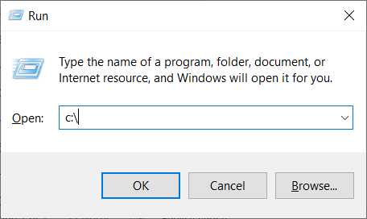

c.	This will open file browser in at c:\ location.

d.	Right click on free space and navigate to new option and click on 'Folder' option.

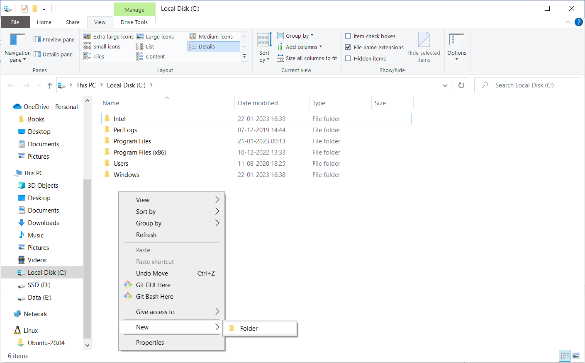

e.	This will create a New Folder. Type and ‘open-jdk’ and press ‘Enter’ key.


5.	Copy the downloaded zip file (from step 3) into Java folder and unzip it.

Use below steps to unzip the file.

a.	Navigate to folder c:\openjdk and open the pasted zip file.

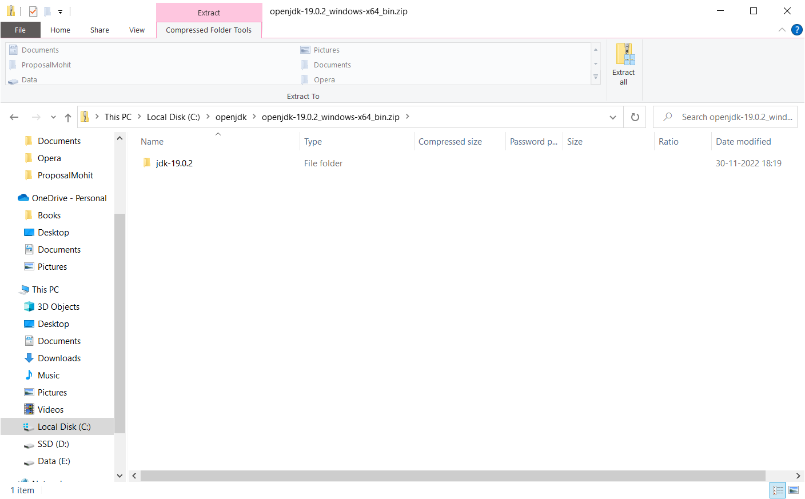

b.	Select all the folder (usually shall contain only a single jdk folder) with-in the zip (press ctrl + a) and copy (press ctrl + c) to clipboard.

c.	Navigate back to c:\openjdk and paste the copied folder (press ctrl + v)

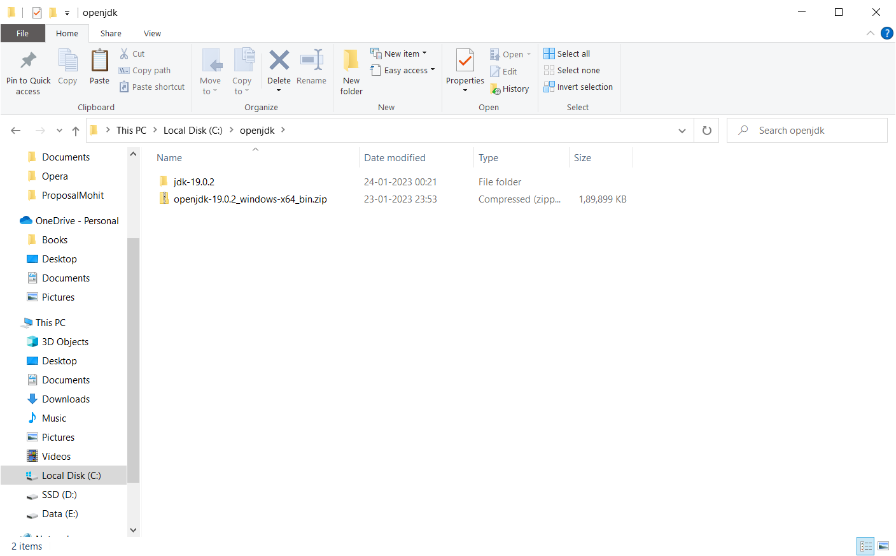

d.	Navigate to the pasted folder (jdk-19.0.2) and make a note of absolute path.

Absolute path in image above will be “C:\openjdk\jdk-19.0.2”. If your folder name is different, make the changes accordingly.
       
### Setting up Java in PATH variable and JAVA_HOME variable.

Java should be set in PATH variable so that it is available to all the programs easily without needing the absolute path of java program.

JAVA_HOME variable is used by many java programs and it is advised to setup same.

Steps to setup:

1.	Press Windows + r key to open ‘Run’ window and type in sysdm.cpl.


2.	Press ‘OK’ button to open System Properties.


3.	Navigate to ‘Advanced’ tab as highlighted in image above and click in ‘Environment Variables’ button as shown in image below.


4.	Under the ‘System Variables’ section, click on 'New' button as highlighted below.


5.	This will open a window that will allow you to setup system variable.


6.	Enter the below values in the corresponding fields and click on ‘OK’ button.

Variable name: JAVA_HOME

Variable value: C:\openjdk\jdk-19.0.2

Note: Variable value should be same as what has been noted down in step 5 – d of Downloading Java section.


7.	A new entry should be created as shown in image below:


8.	Select the row having variable name as ‘Path’ and click on edit button.


9.	Click on ‘New’ button as shown below.


10.	Enter below text in newly added row as show in image below.
%JAVA_HOME%\bin


11.	Select the newly added row and continue to click on ‘Move Up’ button as highlighted below until the newly added row is on the top.


12.	Continue to click on ‘OK’ buttons to close the Windows opened.

### Verifying Java setup:

After performing all the steps above, open jdk should be setup on your computer. Perform below steps to check if the jdk is correctly setup.

1.	Press windows + r button to open ‘Run’ window and type cmd in text box.


2.	Click on ‘OK’ button to open command prompt.

Note: Any existing opened command prompt will not give you correct results. You need to open a new instance of command prompt.

3.	Run the below commands to check to Java is correctly set.

echo %JAVA_HOME%

java -version

javac -version

You should get an output similar to what has been shown in image below.


## On Linux
TODO

## On Mac
1. Click the link below to get to the download page.  
   [https://jdk.java.net/19/](https://jdk.java.net/19/)

2. Click on the "tar.gz" file appropriate for your processor. 

   Intel processor: Click on "tar.gz" to the right of "macOs/x64".
   
   M1 processor: Click on "tar.gz" to the right of "macOS/AArch64". 
   
   

3. After the file has been downloaded, move it over to the home directory if it is not there already. 

   Use the ```cd ~``` command to get to the home directory.

   Use the ```ls``` command to see all of the files in the current directory.

   Before moving the file:   
   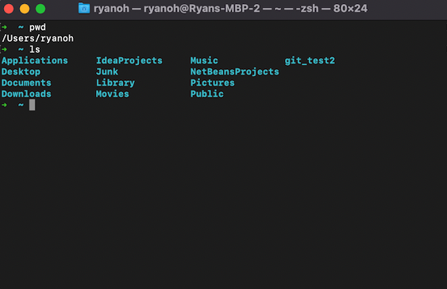  

   After moving the file:  
   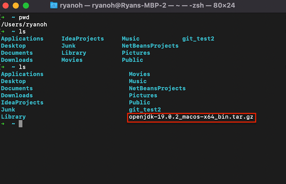


4. Make a directory named "OpenJDK" in the home directory by      typing ```mkdir OpenJDK``` into the terminal.

   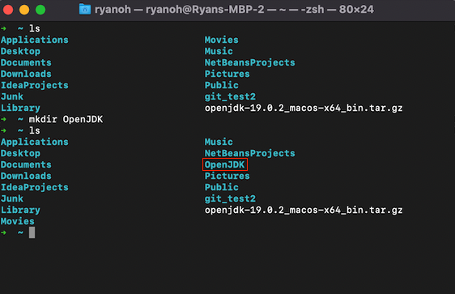

5. Use the commands below extract and move the files into the "OpenJDK" directory.

   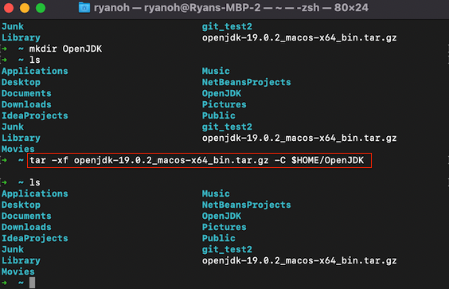  

   For Intel Processor:
   ```tar -xf openjdk-19.0.2_macos-x64_bin.tar.gz -C $HOME/OpenJDK```  

   For M1 Processor:
   ```tar -xf openjdk-19.0.2_macos-aarch64_bin.tar.gz -C $HOME/OpenJDK```

6. Verify that the files exist by entering the following into the terminal to get to the "bin" directory.

   Note that the commands i and ii are equivalent to command iii

      1) ```cd OpenJDK```  
      2) ```cd jdk-19.0.2.jdk/Contents/Home/bin```  
      3) ```cd OpenJDK/jdk-19.0.2.jdk/Contents/Home/bin```  

      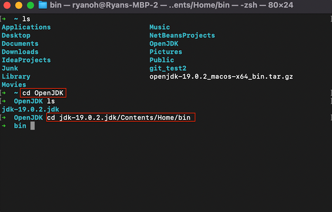

7. Check if the Java runtime environment (JRE) and the Java compiler exist by entering the following independent commands.

   ```./java -version```  

   ```./javac -version```  

   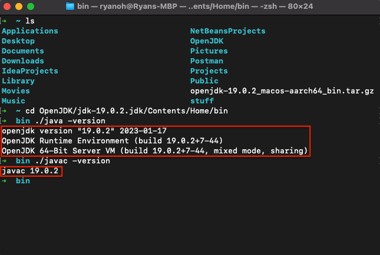

8. Set up home and PATH environment variables by first typing ```cat >> .zshrc``` into the terminal and copy and pasting  

   ```export JAVA_HOME=$HOME/OpenJDK/jdk-19.0.2.jdk/Contents/Home```  

   ```export PATH=$JAVA_HOME/bin:$PATH```  

   If it freezes, hit Crtl+C.  

   

9. You can verify that the home and PATH environment variables are in the file by entering ```cat zshrc``` into the terminal.  

   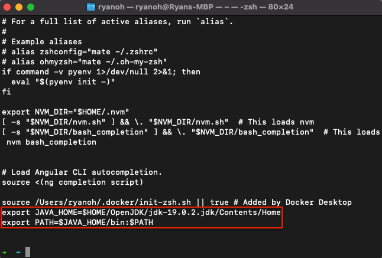

10. Close and reopen the terminal. If everything was successful, you can check the version of JRE and the Java Compiler from the home directory.

      ```java -version```  
      
      ```javac -version```

      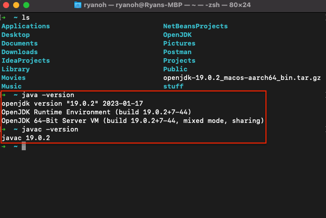


# Setting up a relational DB (PostgresDB)
TODO
Steps to get PostgresDB installed locally
    - Offline installer (https://www.postgresql.org/download/)
    - Docker option
Possibly prerecorded videos. Need offline support

# Git and GitHub
### On windows
## On Windows
1. Go to download page using the following link

   [https://git-scm.com/downloads](https://git-scm.com/downloads)

2. Click on Windows to download for windows
   
3. Upon on clicking on it, you will be navigated to the following page, click 'Click here to download' and Git bash will be downloaded.
   
4. Now, double-click on downloaded exe file. You will be prompted to select Yes or No, select Yes.
5. Installation window will open, click on Next and you will be asked to choose installation directory, choose it and click on next.
   
   
6. For the next upcoming screens just choose the default options and click next and wait for the installation to complete.
7. After the installation is finished, click on Finish.
8. To verify if git was properly installed, open terminal/command prompt/git bash and type

   ```git --version```
9. You should see something like this.
   
    ### Post Install
10. Now that git is successfully installed, there are a couple of things that needs to be done.
    1. First, configure your username and email since every git commit uses this information, type the following commands in terminal

                git config --global user.name "Vijaysai"
                git config --gloabl user.email "vijaysai@example.com"
    2. To verify if your username and email were properly set use the following command
    
        ```git config user.name``` 
    
        ```git config user.email``` 
       
       You should see the email and name that you have set earlier, if not run the commands in step 10.1 again.
    4. Now clone the repository using the following command 
       
       ```git clone https://github.com/koushikkothagal/java-backend-bootcamp.git```
    

# Setting up IntelliJ
## On MacOS
1. Go the download page by clicking the link below.

   [https://www.jetbrains.com/idea/download/?ij80pr#section=mac](https://www.jetbrains.com/idea/download/?ij80pr#section=mac)

2. Click on .dmg underneath Community Edition and select option appropriate for your processor.


3. After the download has finished, click on the completed download.


4. Click and drag the IntelliJ IDEA CE icon over to the Applications folder.


5. Click on New Project.

   

6. Click on the JDK tab and select your newly downloaded Java 17 JDK from the previous section.
   

7. When you open your project for the first time, IntelliJ will be indexing the JDK. You will be able to use the IDE after indexing is complete.


 ### Post Install
 ## Git
8. Click on VCS (Version Control System) and click on "Enable Version Control Integration" on your project. 


9. You will be prompted with choices for "Version Control Integration". Select Git and then OK. 


# Demo of an individual Git + GitHub workflow
TODO

Process of setting up a new GitHub repo, cloning, making changes, commit and push
Cloning a repo, submitting a pull request

# Homework
[Instructions](homework.md)
